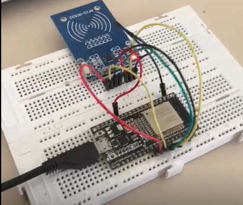
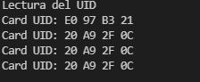

# PRACTICA 6 : Buses de comunicación II (SPI)


## 6.2: _LECTURA DE ETIQUETA RFID_

- CÓDIGO:
  
```CPP
#include <Arduino.h>
#include <SPI.h>
#include <MFRC522.h>
#include <FS.h>
#include <WiFi.h>
#define RST_PIN 21 //Pin 9 para el reset del RC522
#define SS_PIN 5 //Pin 10 para el SS (SDA) del RC522
MFRC522 mfrc522(SS_PIN, RST_PIN); //Creamos el objeto para el RC522
void setup() 
{
  Serial.begin(9600); //Iniciamos la comunicación serial
  SPI.begin(18,19,23,5); //Iniciamos el Bus SPI
  mfrc522.PCD_Init(); // Iniciamos el MFRC522
  Serial.println("Lectura del UID");
}
void loop()
{
  // Revisamos si hay nuevas tarjetas presentes
  if ( mfrc522.PICC_IsNewCardPresent())
  {
  //Seleccionamos una tarjeta
  if ( mfrc522.PICC_ReadCardSerial())
  {
      // Enviamos serialemente su UID
      Serial.print("Card UID:");
      for (byte i = 0; i < mfrc522.uid.size; i++) 
      {
      Serial.print(mfrc522.uid.uidByte[i] < 0x10 ? " 0" : " ");
      Serial.print(mfrc522.uid.uidByte[i], HEX);
      }
    Serial.println();
    // Terminamos la lectura de la tarjeta actual
    mfrc522.PICC_HaltA();
  }
  }
}
```
- MONTAJE:
  


- SALIDA PUERTO SERIE:
  


- FUNCIONAMIENTO:

Include de las librerías necesarias:

'Arduino'
 'SPI'
'MFRC522',
 'FS' 
 'WiFi'
 
  También definimos los pines de reset y Slave Select del RC522 y creamos el objeto con estos pines.
```CPP
#include <Arduino.h>
#include <SPI.h>
#include <MFRC522.h>
#include <FS.h>
#include <WiFi.h>
#define RST_PIN 21 //Pin 9 para el reset del RC522
#define SS_PIN 5 //Pin 10 para el SS (SDA) del RC522
MFRC522 mfrc522(SS_PIN, RST_PIN); //Creamos el objeto para el RC522

```
En el SetUp hacemos el begin del Serial y del SPI,
Iniciamos el MFRC522. Después mostramos por el puerto serie 'Lectura del UID'.
```cpp
void setup() 
{
  Serial.begin(9600); //Iniciamos la comunicación serial
  SPI.begin(18,19,23,5); //Iniciamos el Bus SPI
  mfrc522.PCD_Init(); // Iniciamos el MFRC522
  Serial.println("Lectura del UID");
}
```
En el Loop, esta implementado un if que revisa si hay nuevas tarjetas presentes, si se da esta condición, otro if que comprueva si se lee la tarjeta por el Serial. Una vez dentro, se muestra el UID por el Serial utilizando un bucle for que recorre los bytes del UID del MFRC522 y los imprime por el monitor de forma Hexadecimal. Una vez mostrado, se termina la lectura de la tarjeta con la función 'mfrc522.PICC_HaltA()'.

```cpp
void loop()
{
  // Revisamos si hay nuevas tarjetas presentes
  if ( mfrc522.PICC_IsNewCardPresent())
  {
  //Seleccionamos una tarjeta
  if ( mfrc522.PICC_ReadCardSerial())
  {
      // Enviamos serialemente su UID
      Serial.print("Card UID:");
      for (byte i = 0; i < mfrc522.uid.size; i++) 
      {
      Serial.print(mfrc522.uid.uidByte[i] < 0x10 ? " 0" : " ");
      Serial.print(mfrc522.uid.uidByte[i], HEX);
      }
    Serial.println();
    // Terminamos la lectura de la tarjeta actual
    mfrc522.PICC_HaltA();
  }
  }
}
```